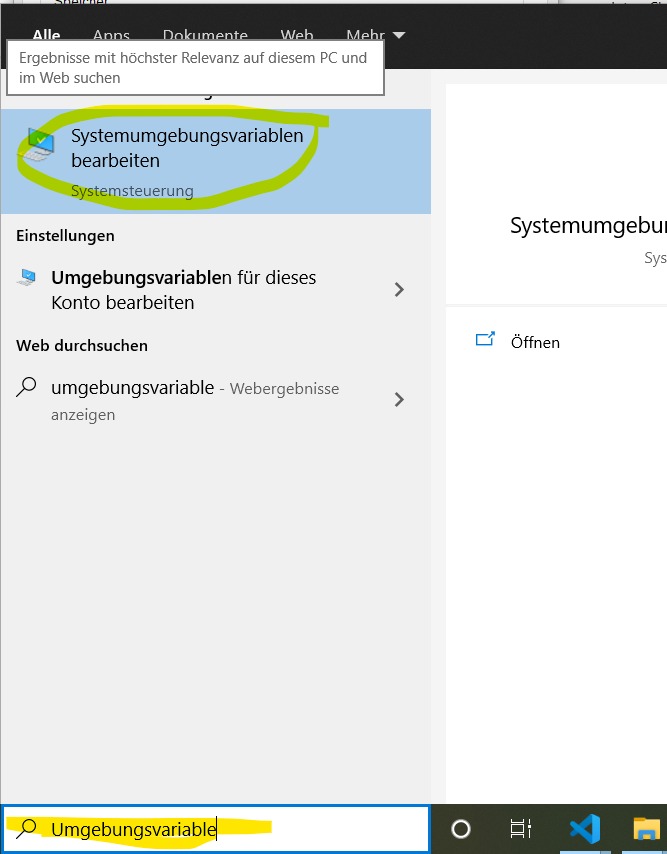
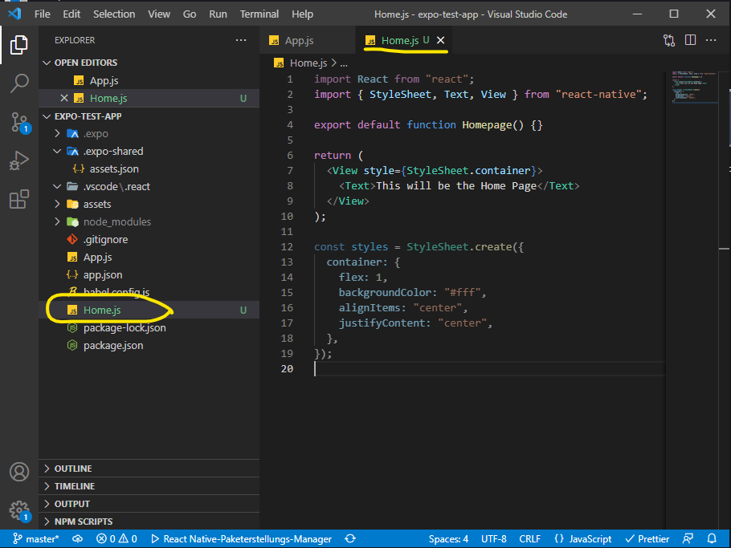

_( Quelle: "Building React Native Applications Using Expo" by Reggie Dawson
https://app.pluralsight.com/library/courses/react-native-applications-using-expo/table-of-contents)_

# React Native Apps mit Expo bauen

# Kapitel I: <br> Einrichten der Entwicklungsumgebung + Mobilen Geräte

## 1. Installationen ...

| Wann? | Was?                                    | Woher?/ Wie?                                                          | Wohin?                                                                             |
| ----- | --------------------------------------- | --------------------------------------------------------------------- | ---------------------------------------------------------------------------------- |
| 1.    | Node.js                                 | _https://nodejs.org/de/_                                              | auf Programmier-Rechner                                                            |
| 2.    | Expo CLI                                | `npm install -g expo-cli` (globale Installation) <br> _( Siehe 1.2 )_ | in Eingabeaufforderung (`C:\Users\<<User>>\`) unter Win 10 auf Programmier-Rechner |
| 3.    | Android Studio (neuste Version)         | _https://developer.android.com/studio_ _( Siehe 1.3 )_                | auf Programmier-Rechner                                                            |
| 4.    | Umgebungsvariablen von Win10 einrichten | _( Siehe: 1.4 )_                                                      | auf Programmier-Rechner                                                            |
| 5.    | Expo Go                                 | Google Play Store ( _https://play.google.com/store_ )                 | auf Android Test-Handy                                                             |
| 6.    | Expo.io - Account anlegen/einloggen     | _https://expo.io/_                                                    | auf genannter Webseite                                                             |

### 1.1 Node.js

( ... )

### 1.2 Expo CLI

Übersicht aller Befehle:

> in Eingabeaufforderung (`C:\Users\<<User>>\`): `expo`

Wenn dieses Befehlsübersicht erscheint ist es erfolgreich installiert:


> Hilfe/Infos zu den Expobefehlen >> in Eingabeaufforderung: `expo <<Befehl>> --help`

### 1.3 Android Studio: erste Einstellungen im SDK Manager

| Wann? | Was?                                                                                                                     | Warum? / Bilder                                                                                                            |
| ----- | ------------------------------------------------------------------------------------------------------------------------ | -------------------------------------------------------------------------------------------------------------------------- |
| 1.3.1 | Android Studio öffnen                                                                                                    | -                                                                                                                          |
| 1.3.2 | Configure > SDK Manager                                                                                                  |  |
| 1.3.3 | Appereance & Behavior > Android SDK > SDK Tools: "Android SDK Build-Tools" anhaken                                       |                                                                   |
| 1.3.4 | "Android SDK Build-Tools" ggf. über "Updates" aktualisieren falls dahinter (wie in Bild 1.3.3) "Updates Available" steht |  <br>                                                   |
| 1.3.5 | Kopiere Pfad der Android SDK in Zwischenablage: <br>                                                                     |                                                                     |
| 1.3.6 | Bestätige alles mit Button "OK"                                                                                          |

### 1.4 Umgebungsvariablen in Windows 10 einrichten

_( In der Ziwschenablage sollte sich noch der Android-SDK-Pfad aus Schritt 1.3.5 befinden)_
| Wann? | Was? | Warum? / Bilder |
| ----- | ---- | ---------- |
| 1.4.1 | Öffne Systemeigenschaften ("System Properties") (zB bei "Ausführen-Suchfeld" nach "Umgebungsvariablen" suchen) |  |
| 1.4.2 | Wähle "Umgebungsvariablen..." |  |
| 1.4.3 | Unter Systemvariablen auf "Neu" klicken |  |
| 1.4.4 | **Eintragen:** <br> - Name der Variablen: "ANDROID_SDK_ROOT"<br> - Wert der Variablen: << Pfad aus Zwischenablage >> <br> - Bestätigen mit "Ok" |  |
| 1.4.5 | **"platform-tools" Ordner zur Pfadvariablen hinzufügen:** <br> - Wähle unter "Systemvariablen den Eintrag "Path" aus <br> - Klicke auf "Bearbeiten" |  |
| 1.4.6 | Füge über "Neu" den Pfad zum platform-tools-Ordner der Android SDK hinzu|  |
| 1.4.7 | **Testen ob Variablen korrekt eingerichtet wurden:**<br> - Eingabeaufforderung NEU öffnen und "adb" eingeben + bestätigen <br> - Es sollte eine Liste mit den ADB-Optionen erscheinen <br> - Falls etwas wie "Command not found" erscheint war etwas in der Einrichtung falsch oder man hatte die Eingabeaufforderung nicht neu geöffnet |  |

## 2. Android Studio: Einrichtung eines virtuellen Smartphones (AVD)

_(Ein Android Virtual Device ist ein von Android Studio simuliertes Smartphone, welches später auf dem Programmier-Rechner angezeigt wird und auf dem Mobile-Software während der Entwicklung getestet werden kann. Nur für diese Funktion haben wir Android Studio in dieser Anleitung überhaupt installiert)_

> nach Einrichtung der Umgebungsvariablen (Siehe 1.4) wieder zurück zu Android Studio wechseln

| Wann? | Was?                                                                                                                                           | Warum? / Bilder                                                 |
| ----- | ---------------------------------------------------------------------------------------------------------------------------------------------- | --------------------------------------------------------------- |
| 2.1   | **AVD-Manager öffnen** <br> - "Configure" >> AVD Manager                                                                                       |    |
| 2.2   | Klicke auf "+ Create Virtual Device..."                                                                                                        |   |
| 2.3   | Wähle ein Geräteprofil aus und klicke auf "Next"                                                                                               |   |
| 2.4   | Wähle eine Betriebssystemversion für das virtuelle Smartphone (ggf. kann man hier auf neuere Androidversion updaten) aus und klicke auf "Next" |  |
| 2.5   | Wähle Konfigurationen für das AVD aus: <br> - Eigener Gerätename <br> - Ausrichtung, Kamerazugriff etc. <br> - Klicke "Finish"                 |  |
| 2.6   | In der Geräteliste von Android Studio sollte nun das neue Gerät gelistet sein                                                                  |  |

## 3. Expo CLI benutzen

_(Command Line Interface ist Nicht dasselbe wie Expo Client)_

| Wann? | Was?                                                                                                                                                                                                                                                                                           | Warum? / Bilder                                                                                                |
| ----- | ---------------------------------------------------------------------------------------------------------------------------------------------------------------------------------------------------------------------------------------------------------------------------------------------- | -------------------------------------------------------------------------------------------------------------- |
| 3.1   | Wechsle zur Eingabeaufforderung (command prompt) von Win10 und navigiere zu dem Ordner in welchem du dein React-Native-Projekt anlegen möchtest. <br> (mögliche Befehle: <br> - `cd ..` (zurück in Ordnerstruktur) <br> - `cd <<Ordnername>> `(vorwärt in Ordnerstruktur) )                    |                                                             |
| 3.2   | Man sollte auf expo.io eingeloggt sein. Man kann durch `expo w` in der Eingabeaufforderung prüfen, ob man eingeloggt ist (bzw. den eingeloggten User anzeigen lassen).                                                                                                                         |                                                            |
| 3.3   | Falls nötig kann man sich auch von hier mit `expo login` anmelden.                                                                                                                                                                                                                             |                                                            |
| 3.4   | Mit `expo logout` kann man sich abmelden.                                                                                                                                                                                                                                                      |                                                            |
| 3.5   | **Projekt anlegen:** <br> - Stelle sicher ob du noch im Wunschordner bist<br> - Befehl: `expo init` <br> - folge den Anweisungen des Menüs in der Eingabeaufforderung, z.B. Projektnamen vergeben, Projekttemplate wählen (wähle "blank") etc.                                                 |  <br>  |
| 3.6   | <br> - expo erzeugt jetzt das neue Projekt, lädt über npm/yarn nötige packages runter; dauert durchaus mal 20 Minuten <br> - Die App befinden sich nun in einem Ordner, der nach der APP benannt ist (hier "expo-test-app") . In diesen Ordner müssen wir während der Appentwicklung befinden. |                                                            |
| 3.7   | Expo Server starten (braucht man grad noch nicht): <br>_(Der Expo Server hosted die App während der Entwicklung. Ist der Server aus hat man keine Vorschau der App und User haben auch keinen App-Zugriff mehr.)_ <br>`expo start`                                                             |                                                            |
| 3.8   | auf virtuellem Mobilgerät Android installieren: <br> `expo client:install:android`                                                                                                                                                                                                             |                                                            |
| 3.9   | auf virtuellem Mobilgerät IOS installieren: <br> `expo client:install:ios`                                                                                                                                                                                                                     |                                                           |
| 3.10  | `expo publish` ermöglicht hosting der App unter einer festehenden URL von Expo, App User haben permaneten Zugriff darauf                                                                                                                                                                       |                                                           |
| 3.11  | `expo build:ios` baut aus dem Expo-Projekt ein IOS-Packet, das im Store veröffentlicht werden kann                                                                                                                                                                                             |                                                           |
| 3.12  | `expo build:android` baut aus dem Expo-Projekt ein Android-Packet, das im Store veröffentlicht werden kann                                                                                                                                                                                     |                                                           |
| 3.13  | `expo build:web` baut Appversion, die auf einem Webhost veröffentlicht werden kann                                                                                                                                                                                                             |                                                           |

## 4. Expo Client (Neuer Name ist Expo Go)

_( Expo Client ist eine Smartphone-App, die auf den realen und virtuellen (zB. emulierte Geräte von Android Studio) mobilen Testgeräten installiert wird um Apps während der Entwicklung mit Expo zu testen. Sie ist für Android und IOS in den App-Stores erhältlich.)_

### 4.1 Installation

_(möglich über Appstore oder Befehle über Expo CLI)_

> **auf virtuellem Gerät in Android Studio:**

| Wann? | Was?                                                                                                                                                                                                                                                                  | Warum? / Bilder                                                          |
| ----- | --------------------------------------------------------------------------------------------------------------------------------------------------------------------------------------------------------------------------------------------------------------------- | ------------------------------------------------------------------------ |
| 4.1.1 | AS öffnen                                                                                                                                                                                                                                                             | -                                                                        |
| 4.1.2 | AVD-Manager öffnen und Play-Button des zuvor angelegten Gerätes (Siehe 2.) klicken                                                                                                                                                                                    |                  |
| 4.1.3 | Virtuelles Handy startet                                                                                                                                                                                                                                              |   |
| 4.1.4 | WIN 10 Eingabeaufforderung öffnen <br><br> _(da wir Expo global installiert hatten, können wir unabhängig davon wo wir uns im Dateisystem befinden, Expo-befehle nutzen)_ <br> - Expo Client auf virtuellem Gerät installieren mit: <br>`expo client:install:android` |                 |
| 4.1.5 | Im Virtuellen Handy sollte nun unter den installierten Apps die App "Expo Go" erscheinen. Klicke darauf um sie zu öffnen.                                                                                                                                             |  |

### 4.2 EXPO Client (Neuer Name ist Expo Go) - Überblick

| Wann? | Was?                                                                                                                                                                                                                                                     | Warum? / Bilder                                           |
| ----- | -------------------------------------------------------------------------------------------------------------------------------------------------------------------------------------------------------------------------------------------------------- | --------------------------------------------------------- |
| 4.2.1 | Direkt nach dem Starten von Expo Go sieht man diese Projektübersicht (PROJECTS) <br> - CLIPBOARD zeigt alle gespeicherten Projekt-URLs und auch geöffnete Projekte an (wenn man in Expo-Account eingeloggt ist auch alle kürzlich bearbeiteten Projekte) |  |
| 4.2.2 | - PROFILE Ein/Ausloggen in Expo-Account                                                                                                                                                                                                                  |  |
| 4.2.3 | -                                                                                                                                                                                                                                                        | -                                                         |
| 4.2.4 | -                                                                                                                                                                                                                                                        | -                                                         |

## 5. Expo SDK

_( Webbasierte Frameworks benötigen für die Mobile-Entwicklung eine Weg mit der Handyhardware zu interagieren. Bei Expo übernehmen das Module der Expo SDK )_

Siehe Expo-Doku https://docs.expo.dev/versions/latest/


**Beispiele für Expo SDK-Module:**
| Was? | Beschreibung / Bilder |
| - | - |
| | **`Zugriffsmodule auf Handyhardware:`** |
| Accelerator | Beschleunigungssensor |
| Camera | Kamerazugrif für Fotos und Videos |
| Audio | Aufnahme und Wiedergabe von Ton |
| | **`Zugriffsmodule auf Handysoftware:`** |
| SMS | erlaubt Zurgriff auf SMS-App des Handys, z.B. kann man ein Array mit Adressen übergeben, die dann alle eine SMS bekommen |
| Calender | Zugriff auf Kalender des Handys |
| WebBrowser | Zugriff auf Browser des Handys, um auf Webseiten innerhalb unserer App zuzugreifen|
| AsyncStorage | Speicherung einfacher Daten (nur Strings)|
| SQLite | Speicherung komplexer Daten einer Datenbank über WebSQLartiger-API|
| | **`Zugriffsmodule auf Dienste von Drittanbietern:`** |
| Google | integriert Google-Login in unsere App|
| Facebook | integriert Facebook-Login in unsere App|

## 6. Nutzung des Expo Development Servers

\_( Wenn man eine App mit Expo CLI startet, starten im Hintergrund zwei Serverprozesse:

- **React Native Package Server:** liefert kompiliertes JavaScript einschließlich Medieninhalte wie Bilder )\_
- **Expo Development Server:** stellt, die mit Expo Client verbundene, URL zur Verfügung)\_

| Wann? | Was?                                                                                                                                                                                                                                                                                                           | Wo?                                                                                                              | Warum? / Bilder                                                                                             |
| ----- | -------------------------------------------------------------------------------------------------------------------------------------------------------------------------------------------------------------------------------------------------------------------------------------------------------------- | ---------------------------------------------------------------------------------------------------------------- | ----------------------------------------------------------------------------------------------------------- |
| 6.1   | Expo Development Server starten: `expo start` <br> - der angezeigte QR-Code kann mit der Expo Go-App des Testhandys gescannt werden um unsere zu entwickelnde App zu starten. Bisher besteht unsere App nur aus der Basis-App, welche mit dem Anlegen des Expo-Projektes (Siehe Schritt 3.5) entstand          | in der WIN 10 - Eingabeaufforderung im Ordner des zuvor angelegten Expo-Projektes (hier Ordner "expo-test-app")) |                                                         |
|       | Erfolgreich gestartete Basis-App im virtuellen/realen Handy und im Browser:                                                                                                                                                                                                                                    |                                                                                                                  |                                                        |
| 6.2   | Drückt man Taste "`P`" kann man zwischen `Development-Mode` (default) und `Production Mode wechseln` <br> - des Weiteren kann man von hier den Metro Bundler neu starten oder das Projekt im Editor öffnen                                                                                                     | Eingabeaufforderung                                                                                              |                                                        |
| 6.3   | Drückt man Taste "`D`" öffnen sich die DevTools (Metro Bundler) im Standard Browser (unteres Bild). In den DevTools kann man vieles machen, was es auch im Expo CLI gibt.                                                                                                                                      | Eingabeaufforderung                                                                                              |   |
| 6.4   | 1. Öffne Android Studio und starte den Emulator (= virtuelles Handy) (Siehe Schritt 4.1.2) <br> 2. Drücke auf `"Run on Android device/emulator"` <br> 3. Das Javascript der App wird verpackt; danach sollte die App starten <br> 4. Öffne "App.js" aus dem Ordner deines Projektes um deine App zu entwickeln | Eingabeaufforderung                                                                                              |   |

---

# Kapitel II: <br> Apps mit React Native und Expo bauen

> > > > > Bei Kompatibilitätsproblemen mit unterschiedlichen Versionen von RN-Modulen `expo update` in Projektordner laufen lassen

## 7. Routing (mit React Navigation) einrichten

### 7.1 Home.js anlegen

_im Projekt Ordner der App_


**Home.js:**

```javascript
import React from "react";
import { StyleSheet, Text, View } from "react-native";

export default function Homepage() {
  return (
    <View style={StyleSheet.container}>
      <Text>This will be the Home Page</Text>
    </View>
  );
}
const styles = StyleSheet.create({
  container: {
    flex: 1,
    backgroundColor: "#fff",
    alignItems: "center",
    justifyContent: "center",
  },
});
```

### 7.2 React-Navigation über Eingabeaufforderung im Projektordner installieren

`npm install @react-navigation/native @react-navigation/stack`


> nun müssen noch andere abhängige Bibliotheken installiert werden:

`expo install react-native-reanimated react-native-gesture-handler react-native-screens react-native-safe-area-context @react-native-community/masked-view`


### 7.3 In App.js Routing hinzufügen

**App.js:**

```javascript
import "react-native-gesture-handler";
import React from "react";
import { NavigationContainer } from "@react-navigation/native";
import { createStackNavigator } from "@react-navigation/stack";
import Homepage from "./Home";

const Stack = createStackNavigator();

export default function App() {
  return (
    <>
      <NavigationContainer>
        <Stack.Navigator initialRouteName="Globomantics" headerMode="screen">
                {/* "initialRouteName" bestimmt welche Seite nach Appstart angezeigt wird */}
          <Stack.Screen name="Globomantics" component={Homepage}></Stack.Screen>
                  {/* name-Prop ist per default der Headername der Seite */}
        </Stack.Navigator>
      </NavigationContainer>
    </>
  );
}
```

## 8. Header einrichten

### 8.1 Header.js im Projektordner anlegen:

```javascript
import React from "react";
import { StyleSheet, Text, View, Image } from "react-native";
import logo from "./assets/globomantics-logo-bug-black.png";

export default function Header(props) {
  return (
    <View style={styles.header}>
      <Image source={logo} style={{ width: 35, height: 35 }} />
      <View>
        <Text style={styles.text}>{props.headerDisplay}</Text>
      </View>
    </View>
  );
}

const styles = StyleSheet.create({
  header: {
    width: "100%",
    height: 70,
    alignItems: "center",
    justifyContent: "center",
  },

  text: {
    fontFamily: "OpenSans", // müssen noch Expo-Fontmodul und OpenSans installieren
  },
});

```

### 8.2 Expo Font Module über Eingabeaufforderung im Porjektordner installieren: <br> `expo install expo-font`


### 8.3 App.js anpassen

**App.js**

```javascript
import "react-native-gesture-handler";
import { StatusBar } from "expo-status-bar";
import React from "react";
import { NavigationContainer } from "@react-navigation/native";
import { createStackNavigator } from "@react-navigation/stack";
import Homepage from "./Home";

/*Neu*/ import { Platform } from "react-native";
/*Neu*/ import { useFonts } from "expo-font";
/*Neu*/ import AppLoading from "expo-app-loading";
/*Neu*/ import Header from "./Header";

const Stack = createStackNavigator();

export default function App() {
/*Neu*/   let [fontsLoaded] = useFonts({
/*Neu*/     OpenSans: require("./assets/fonts/OpenSans-Regular.ttf"),
/*Neu*/   });

  if (!fontsLoaded) {
    // nötig, um App erst zu Laden nachdem Schriften geladen sind
    return <AppLoading />;
  } else {
    return (
      <>
        <NavigationContainer
/*Neu*/   style={{
/*Neu*/     paddingTop:
            Platform.OS === "android" ? StatusBar.currentHeight : 0,
/*Neu*/   }}
        >
          <Stack.Navigator
            initialRouteName="Globomantics"
/*Neu*/     headerMode="screen"
          >
            {/* "initialRouteName" bestimmt welche Seite nach Appstart angezeigt wird */}
            {/* // headerMode Stellt sicher dass Header teil des Screens ist  */}

            <Stack.Screen
              name="Globomantics"
              component={Homepage}
/*Neu*/       options={{  header: () => <Header headerDisplay="Globomantics" />}}
            ></Stack.Screen>
            {/* name-Prop ist per default der Headername der Seite */}
          </Stack.Navigator>
        </NavigationContainer>
      </>
    );
  }
}

```

## 9. Footer einrichten
**RootNavigation.js**
```javascript
import * as React from "react";

export const navigationRef = React.createRef();

export function navigate(name) {
  navigationRef.current?.navigate(name);
}

```
**Footer.js**
```javascript
import React from "react";
import { StyleSheet, Text, View, TouchableOpacitiy } from "react-native";
import * as RootNavigation from "./RootNavigation";

export default function Footer() {
  return (
    <View style={StyleSheet.footer}>
      <TouchableOpacitiy
        style={StyleSheet.button}
        onPress={() => RootNavigation.navigate("Globomantics")}
      >
        <Text>Home</Text>
      </TouchableOpacitiy>
      <TouchableOpacitiy style={StyleSheet.button}>
        <Text>About</Text>
      </TouchableOpacitiy>
      <TouchableOpacitiy style={StyleSheet.button}>
        <Text>Quote</Text>
      </TouchableOpacitiy>
      <TouchableOpacitiy style={StyleSheet.button}>
        <Text>Catalog</Text>
      </TouchableOpacitiy>
    </View>
  );
}

const styles = StyleSheet.create({
  footer: {
    width: "100%",
    height: 80,
    flexDirection: "row",
    alignItems: "flex-start",
    justifyContent: "center",
  },
  button: {
    padding: 20,
  },
});

```

**App.js**

```javascript
import "react-native-gesture-handler";
import { StatusBar } from "expo-status-bar";
import React from "react";
import { NavigationContainer } from "@react-navigation/native";
import { createStackNavigator } from "@react-navigation/stack";
import Homepage from "./Home";

import { Platform } from "react-native";
import { useFonts } from "expo-font";
import AppLoading from "expo-app-loading";
import Header from "./Header";
/*Neu*/ import Footer from "./Footer";
/*Neu*/ import { navigationRef } from "./RootNavigation";

const Stack = createStackNavigator();

export default function App() {
  let [fontsLoaded] = useFonts({
    OpenSans: require("./assets/fonts/OpenSans-Regular.ttf"),
  });

  if (!fontsLoaded) {
    // nötig, um App erst zu Laden nachdem Schriften geladen sind
    return <AppLoading />;
  } else {
    return (
      <>
        <NavigationContainer
          style={{
            paddingTop: Platform.OS === "android" ? StatusBar.currentHeight : 0,
          }}
/*Neu*/   ref={navigationRef}
        >
          <Stack.Navigator initialRouteName="Globomantics" headerMode="screen">
            {/* "initialRouteName" bestimmt welche Seite nach Appstart angezeigt wird */}
            {/* // headerMode Stellt sicher dass Header teil des Screens ist  */}

            <Stack.Screen
              name="Globomantics"
              component={Homepage}
              /*Neu*/ options={{
                header: () => <Header headerDisplay="Globomantics" />,
              }}
            ></Stack.Screen>
            {/* name-Prop ist per default der Headername der Seite */}
          </Stack.Navigator>
{/*Neu*/} <Footer />
        </NavigationContainer>
      </>
    );
  }
}

```

## 10. Home Page einrichten

(nur Beispiel wie man News einer NewsAPI einbindet:)
> 1. Account auf https://newsapi.org anlegen und API-Key speichern
> 2. AccHome.js anpassen

**Home.js**
```javascript
/*NEU*/ import React, { useEffect, useState } from "react";
/*NEU*/ import {
  StyleSheet,
  Text,
  View,
  ActivityIndicator,
  FlatList,
  TouchableWithoutFeedback,
  TouchableWithoutFeedbackBase,
} from "react-native";
/*NEU*/ export default function Homepage(navigation) {
/*NEU*/const [dataLoading, finishLoading] = useState(true);
/*NEU*/const [newsData, setData] = useState([]);

/*NEU*/ useEffect(() => {
/*NEU*/     fetch(
/*NEU*/         "https://newsapi.org/v2/everything?q=tech&apiKey=55afeca5a50648b1a6ab1ce4b92a2665")
/*NEU*/          .then((response) => response.json())
/*NEU*/          .then((json) => setData(json.articles))
/*NEU*/          .catch((error) => console.error(error))
/*NEU*/          .finally(() => finishLoading(false))
/*NEU*/   }, []);

/*NEU*/ const storyItem = ({item}) =>{
/*NEU*/     return(
/*NEU*/    <TouchableWithoutFeedback 
/*NEU*/          onPress={() => navigation.navigate("NewsDetail", {url: item.url})
/*NEU*/          }
{/*NEU*/}   >
{/*NEU*/}        <View style={styles.listings}>
{/*NEU*/}               <Text style={styles.title}>{item.title}</Text>
{/*NEU*/}               <Image 
{/*NEU*/}                   style={styles.thumbnail} 
{/*NEU*/}                   source={{uri: item.urlToImage}}
{/*NEU*/}                />
{/*NEU*/}               <Text style={styles.blurb}>{item.description}</Text>
{/*NEU*/}        </View>
{/*NEU*/}  </TouchableWithoutFeedback>
      )
    }

  return (
      <View style={StyleSheet.container}>
{/*NEU*/} {dataLoading ? <ActivityIndicator/> : (
/*NEU*/       <FlatList 
/*NEU*/           data={newsData}
/*NEU*/           renderItem={storyItem}
/*NEU*/           keyExtractor={(item) => item.url}
/*NEU*/       />
/*NEU*/   )}
    </View>
  );
}
const styles = StyleSheet.create({
  container: {
    flex: 1,
          backgroundColor: "#fff",
          alignItems: "center",
          justifyContent: "center",
  /*NEU*/ width: "100%",
  /*NEU*/ padding: 20,
  },
/*NEU*/ thumbnail:{
    height: 100,
    width: "98%",
  },
/*NEU*/ listings:{
  paddingTop: 15,
  paddingBottom: 25,
  borderBottomColor: "black",
  borderBottomWidth: 1,
},

/*NEU*/ title:{
  paddingBottom: 10,
  fontFamily: "OpenSans",
  fontWeight: "bold",
},


/*NEU*/ blurb:{
  fontFamily: "OpenSans",
  fontStyle: "italic",
},


});

```
Zwischenstand der App: <br>


## 11. News Detail Page einrichten
**+++.js**

```javascript

```

## 12. About einrichten
**+++.js**

```javascript

```

## 13. Quote einrichten


| Wann? | Was? | Warum? / Bilder |
| ----- | ---- | --------------- | -------------- |
| 3.1   | -    | -               | zu entwickelde |

**+++.js**

```javascript

```
