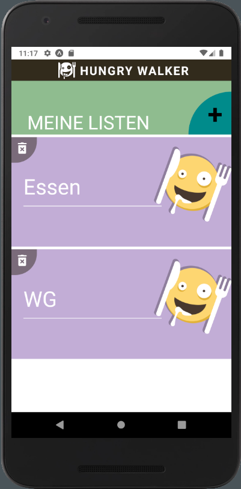
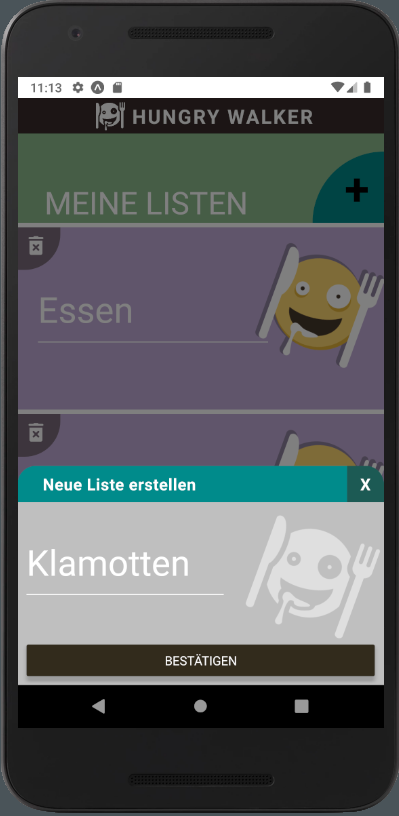
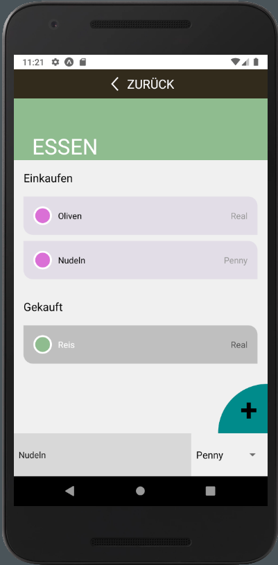

 möp

# Hungry Walker
This CRUD-App is a shopping list, where you can organize multiple lists and attach your prefered local shops to the list items.

## The Idea

More than one time I came home and noticed I should have bought something. Noodles, toilet paper, garbage bags, ... etc. . 
10 minutes ago I was passing by somes shops, but had not thought of it. I wished there would be a shopping list app, which: 
- knows where I want to buy a specific item,
- when I am close to that prefered shop and 
- reminds me of buying it with a push notification. 

So the idea of Hungry Walker was born. A shopping list app for people with after-work-zombie-brains like mine ;-).

(Notice: So far not every mentioned functionality is already implemented. At the moment you can just create multiple shopping lists and 
attach a prefered shop to every product entry you add.)

## Used Programming Technologies

Main technology is React Native. In detail you find the usage of: 
 - Functional programming as basic concept
 - SQLite as persistent local storage
 - Expo as framework/platform to test the app on devices

 ## Screenshots
 |          Main list view           |        Modal dialog of main list           |       Product list view          |
| :----------------------------: | :------------------------------: | :------------------: |
|  |   |  |

## Planned Improvements
- Push-up notifications if user is close to specific shop
- Map where you can see the exact shop location

